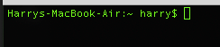

# Terminal Nice
Una terminal bonita y totalmente personalizada.


Agrega en el .bash_profile
````console
for file in ~/.{path,bash_prompt,exports,aliases,functions,extra}; do
	[ -r "$file" ] && [ -f "$file" ] && source "$file";
done;
````

Antes 



Despues


